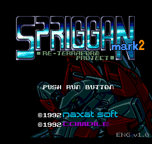
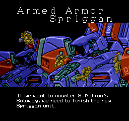
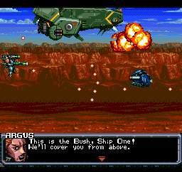
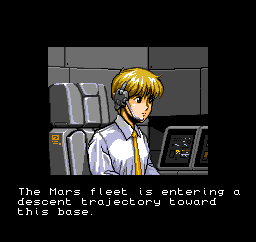
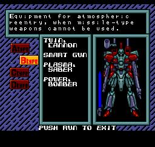
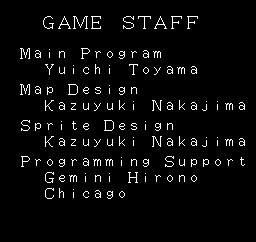

# Spriggan Mark 2 English Version

English version patch for **Spriggan Mark 2: Re-Terraform Project** on PC Engine Super CD-ROM².

This version provides the following:
- English subtitles for voiced cutscenes
- Translated title cards and character labels
- Translated in-level dialogue
- Translated menus, ending sequence, and credits
- Auto-save QoL feature: Continue from last finished level

English text that was already present in the game hasn't been modified except for obvious errors.

<table align="center">
  <tr>
    <td>
      <a href="https://github.com/gagnonpl/spriggan-mark2-en/raw/master/screenshots/title.png">
        
      </a>
    </td>
    <td>
      <a href="https://github.com/gagnonpl/spriggan-mark2-en/raw/master/screenshots/cutscenes.png">
        
      </a>
    </td>
  </tr>
  <tr>
    <td>
      <a href="https://github.com/gagnonpl/spriggan-mark2-en/raw/master/screenshots/level.png">
        
      </a>
    </td>
    <td>
      <a href="https://github.com/gagnonpl/spriggan-mark2-en/raw/master/screenshots/cutscenes-2.png">
        
      </a>
    </td>
  </tr>
  <tr>
    <td>
      <a href="https://github.com/gagnonpl/spriggan-mark2-en/raw/master/screenshots/weapons.png">
        
      </a>
    </td>
    <td>
      <a href="https://github.com/gagnonpl/spriggan-mark2-en/raw/master/screenshots/credits.png">
        
      </a>
    </td>
  </tr>
</table>

## Downloads

| File | Description |
| --- | --- |
| [`spriggan-mark2-english-v1.0.xdelta`](https://github.com/gagnonpl/spriggan-mark2-en/releases/latest/download/spriggan-mark2-english-v1.0.xdelta) | xdelta3 patch |
| [`spriggan-mark2-english-v1.0.cue`](https://github.com/gagnonpl/spriggan-mark2-en/releases/latest/download/spriggan-mark2-english-v1.0.cue) | cue file |
| [`README.txt`](/releases/latest/download/README.txt) | Instructions and checksums |
| [`xdelta3`](https://github.com/jmacd/xdelta-gpl/releases) | Patching tool |
| [`xdelta3 GUI`](https://github.com/Moodkiller/xdelta3-gui-2.0/releases) | Patching tool (GUI) |
| [`spriggan-mark2-english-v1.0.ccd`](https://github.com/gagnonpl/spriggan-mark2-en/releases/latest/download/spriggan-mark2-english-v1.0.ccd) | (optional) ccd file |
## Patching

Apply the patch with `xdelta3`:

```sh
xdelta3 -d -s "Spriggan Mark 2 - Re Terraform Project (1992)(Naxat)(JP).img" spriggan-mark2-english-v1.0.xdelta spriggan-mark2-english-v1.0.img
```

Then use the included CUE file to launch the patched image.

Use the exact source image listed below. The patch will not apply correctly to a different dump.

Optionally, a corrected CCD file is provided since the patched image is slightly bigger, but most people shouldn't need that.

## Checksums

### Expected source image

**TOSEC set:** `NEC PC-Engine CD & TurboGrafx-16 CD - Games - [IMG]`  
**TOSEC name:** `Spriggan Mark 2 - Re Terraform Project (1992)(Naxat)(JP)`

| Hash | Value |
| --- | --- |
| CRC32 | DBE38C87
| MD5 | bf28ca897aebb9a8c0f49589edc3d6a9
| SHA-1 | 93e68a7202ebd31f84ab173458ba61060a6bebb5


### Patched output image

| Hash | Value |
| --- | --- |
| CRC32 | 5BAE39BD |
| MD5 | 19ff41061bbacd4b4a2ad5d129200670 |
| SHA-1 | 7438773a6038c05807393c1259548486b77485cf |

### ROMhacking.net
https://www.romhacking.net/translations/7662/

## Credits

English version by **Luke Gagnon**.
