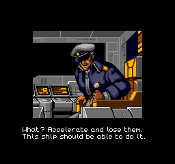

# Spriggan Mark 2 English Version

English version patch for **Spriggan Mark 2: Re-Terraform Project** on PC Engine Super CD-ROM².

This version provides the following:
- English subtitles for voiced cutscenes
- Translated title cards and character labels
- Translated in-level dialogue
- Translated menus, ending sequence, and credits
- Auto-save QoL feature: Continue from last finished level

English text that was already present in the game hasn't been modified except for obvious errors.

<table align="center">
  <tr>
    <td>
      <a href="https://github.com/gagnonpl/spriggan-mark2-en/raw/master/screenshots/title.png">
        
      </a>
    </td>
    <td>
      <a href="https://github.com/gagnonpl/spriggan-mark2-en/raw/master/screenshots/cutscenes.png">
        
      </a>
    </td>
  </tr>
  <tr>
    <td>
      <a href="https://github.com/gagnonpl/spriggan-mark2-en/raw/master/screenshots/level.png">
        
      </a>
    </td>
    <td>
      <a href="https://github.com/gagnonpl/spriggan-mark2-en/raw/master/screenshots/cutscenes-3.png">
        
      </a>
    </td>
  </tr>
  <tr>
    <td>
      <a href="https://github.com/gagnonpl/spriggan-mark2-en/raw/master/screenshots/weapons.png">
        
      </a>
    </td>
    <td>
      <a href="https://github.com/gagnonpl/spriggan-mark2-en/raw/master/screenshots/credits.png">
        
      </a>
    </td>
  </tr>
</table>

## Downloads

| File | Description |
| --- | --- |
| [`spriggan-mark2-english-v1.2.xdelta`](https://github.com/gagnonpl/spriggan-mark2-en/releases/download/v1.2/spriggan-mark2-english-v1.2.xdelta) | Multifile xdelta patch |
| [`README.txt`](https://raw.githubusercontent.com/gagnonpl/spriggan-mark2-en/v1.2/README.txt) | Instructions and hashes |
| [`xdelta-multifile`](https://github.com/gagnonpl/xdelta-multifile/releases) | Patching tool |
## Patching

The patch modifies Tracks 02 and 37 of the Redump disc image. Apply it with `xdelta-multifile`:

1. Extract the complete Redump BIN/CUE set in a directory, e.g. `original`
2. Make a copy of the set in a separate directory, e.g. `patched`.
3. Run:
```sh
xdelta-mf -f -d \
  -s "original/Spriggan Mark 2 - Re Terraform Project (Japan) (Track 02).bin" \
  -t "patched/Spriggan Mark 2 - Re Terraform Project (Japan) (Track 02).bin" \
  -s "original/Spriggan Mark 2 - Re Terraform Project (Japan) (Track 37).bin" \
  -t "patched/Spriggan Mark 2 - Re Terraform Project (Japan) (Track 37).bin" \
  spriggan-mark2-english-v1.2.xdelta
```

Use the exact source files listed below. The patch will not apply correctly to a different dump.

## Hashes

### Expected original files

**Redump set:** `NEC - PC Engine CD & TurboGrafx CD`  
**Redump name:** `Spriggan Mark 2 - Re Terraform Project (Japan)`

#### `Spriggan Mark 2 - Re Terraform Project (Japan) (Track 02).bin`
| Hash | Value |
| --- | --- |
| CRC32 | EB604489
| MD5 | 8679be50ee1c2d12e3d6cd5a0a3d1707
| SHA-1 | 6db64581490afbd5f7c538f31bc63a6f0695dcb7

#### `Spriggan Mark 2 - Re Terraform Project (Japan) (Track 37).bin`
| Hash | Value |
| --- | --- |
| CRC32 | D66E0920
| MD5 | fc8d1356ea9f828c5a466f29524e6493
| SHA-1 | eb9b3d55b0acb7e477fd2b262096863c31aacf4d

### Patched output images
#### `Spriggan Mark 2 - Re Terraform Project (Japan) (Track 02).bin`
| Hash | Value |
| --- | --- |
| CRC32 | C0988FB5
| MD5 | 9ed3453c7684af7c85b6f8ae2ff24a61
| SHA-1 | 3516c2e137dbe4b096372db8a04dfe9c5bc66478
#### `Spriggan Mark 2 - Re Terraform Project (Japan) (Track 37).bin`
| Hash | Value |
| --- | --- |
| CRC32 | 0ABC5022
| MD5 | e8d817390f8d570e2c76b9827c0769be
| SHA-1 | 4b0847f2347c248ddc7986925edb37e60bb05b8d

### ROMhacking.net
https://www.romhacking.net/translations/7662/

## Credits

English version by **Luke Gagnon**.
